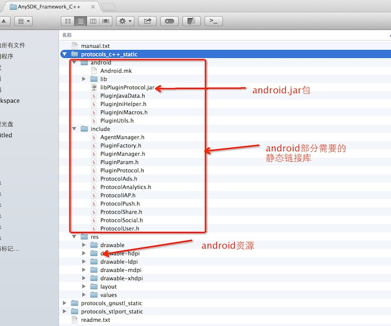
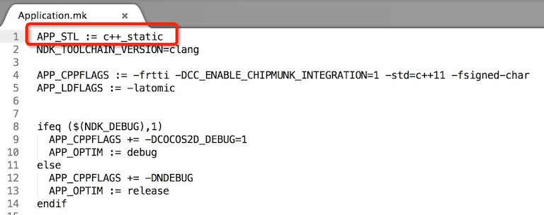
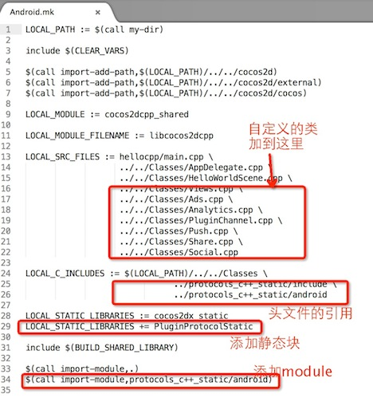
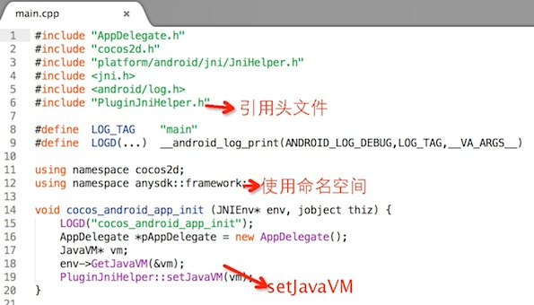
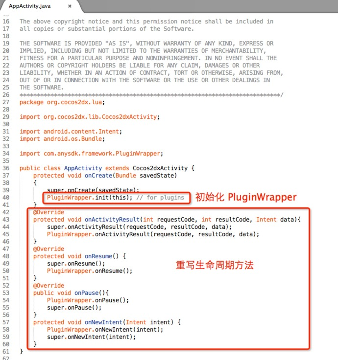

<b>Sample_CPP</b>

简要说明: sample of cocos2d-x cpp

使用版本: cocos2d-x 3.3rc0

接入文档: http://docs.anysdk.com/CppTutorial

运行: ./cocos2d/tools/cocos2d-console/bin/cocos run -p android

###cocos2d-x c++接入anysdk简要流程：
####一：获取AnySDK Framework
到AnySDK官方网站注册登陆，然后到AnySDK Framework的下载页面( http://www.anysdk.com/downloads ) 下载完整的anysdk框架包，选择AnySDK Framework for C++进行下载

解压后如下图：

####二：拷贝anysdk framework stl库到protocols文件夹
#####protocols文件：
首先，查看hello项目的hello/proj.android/jni/Application.mk文件第一行找到stl库类型设置。 如下图：

然后，进入anysdkTest项目的frameworks/runtime-src/proj.android目录，新建protocols文件夹。根据上面查看到的stl类型，选取AnySDK_Framework_C++/protocols_c++_static库，然后将该目录下的android和include文件夹拷贝到protocols目录。
#####res文件:
将AnySDK_Framework_C++/protocols_c++_static目录下的res文件，拷贝到proj.android/res目录下，注意选择合并，避免文件覆盖。
#####放置libPluginProtocol.jar包：
在proj.android目录下新建libs文件夹，然后将AnySDK_Framework_C++/protocols_c++_static/android目录下的libPluginProtocol.jar拷贝到该目录下。
####三：编辑 mk 文件
#####修改LOCAL_C_INCLUDES：
在LOCAL_C_INCLUDES 新增目录：protocols/android  和 protocols/include，例：
<pre>
LOCAL_C_INCLUDES := $(LOCAL_PATH)/../../Classes	\
      $(LOCAL_PATH)/../protocols/android	\
      $(LOCAL_PATH)/../protocols/include
</pre>
#####新增 static lib:
例：
<pre>LOCAL_WHOLE_STATIC_LIBRARIES += PluginProtocolStatic</pre>
#####新增 modules:
例：
<pre>$(call import-module,protocols/android)</pre>
android.mk(修改之后)如图：

####四：增加NDK_MODULE_PATH
修改 build-cfg.json文件的 ndk_module_path 部分如下：
<pre>
"ndk_module_path" :[
        "../cocos2d",
        "../cocos2d/cocos",
        "../cocos2d/external",
        ""
    ],
</pre>
####五：添加设置javaVM代码
修改main.cpp文件(在jni下面)
<pre>
#include "PluginJniHelper.h"
    
#define  LOG_TAG    "main"
#define  LOGD(...)  __android_log_print(ANDROID_LOG_DEBUG,LOG_TAG,__VA_ARGS__)
    
using namespace cocos2d;
using namespace anysdk::framework;
    
void cocos_android_app_init (JNIEnv* env, jobject thiz) {
    LOGD("cocos_android_app_init");
    AppDelegate *pAppDelegate = new AppDelegate();
    JavaVM* vm;
    env->GetJavaVM(&vm);
    PluginJniHelper::setJavaVM(vm);
}
</pre>
如图：

####六：配置AndroidManifest.xml 添加框架需要的权限

uses-permission android:name="android.permission.INTERNET" 

uses-permission android:name="android.permission.ACCESS_NETWORK_STATE" 

uses-permission android:name="android.permission.ACCESS_WIFI_STATE" 

uses-permission android:name="android.permission.RESTART_PACKAGES" 

uses-permission  android:name="android.permission.KILL_BACKGROUND_PROCESSES" 

####七：在JAVA层初始化AnySDK Framework框架
修改项目下/proj.android/src/org/cocos2dx/cpp/AppActivity.java文件：
<pre>
import com.anysdk.framework.PluginWrapper;
   
public class MainActivity extends Activity{
   protected void onCreate(Bundle savedState)
   {
      super.onCreate(savedState);
      PluginWrapper.init(this); // for plugins
   }
}
</pre>
重写Activity生命周期相关方法，代码如下:
<pre>
@Override
protected void onActivityResult(int requestCode, int resultCode, Intent data){
	super.onActivityResult(requestCode, resultCode, data);
	PluginWrapper.onActivityResult(requestCode, resultCode, data);
}
@Override
protected void onResume() {
    super.onResume();
    PluginWrapper.onResume();
}
@Override
public void onPause(){
    PluginWrapper.onPause();
    super.onPause();
}
@Override
protected void onNewIntent(Intent intent) {
    PluginWrapper.onNewIntent(intent);
    super.onNewIntent(intent);
}
</pre>
AppActivity.java:

------------------
接入完成，下面就可以使用了。